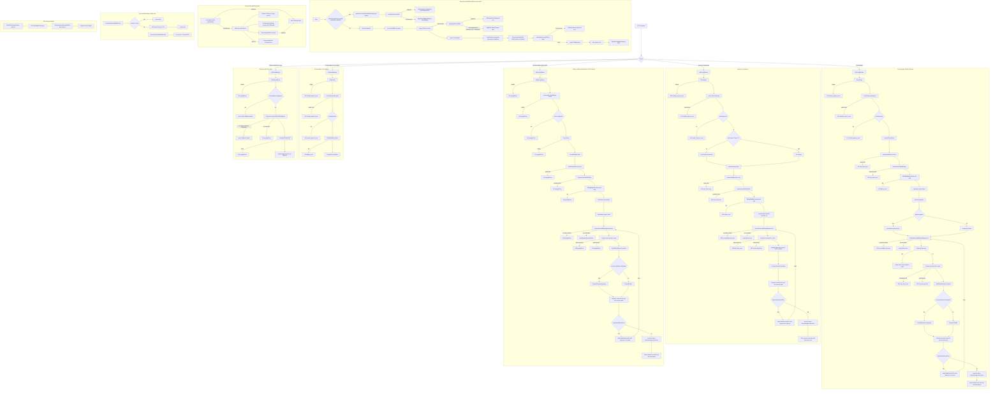

```mermaid
flowchart TD
  %% Master dispatch
  A[HTTP Request] --> B{Route}
  B -->|v1 messages| GA0
  B -->|openai v1 responses| OA0
  B -->|v1beta models model action| GM0
  B -->|v1 messages count tokens| GT0
  B -->|v1beta models list or get| GL0

  %% =========================
  %% FLOW A: Claude Gateway
  %% =========================
  subgraph FLOW_A["v1 messages Claude Gateway"]
    GA0[Auth middleware] --> GA1[Read body]
    GA1 -->|empty| GA1E[400 invalid_request_error]
    GA1 --> GA2[ParseGatewayRequest]
    GA2 -->|parse error| GA2E[400 invalid_request_error]
    GA2 --> GA3{model present}
    GA3 -->|no| GA3E[400 invalid_request_error]
    GA3 --> GA4[streamStarted false]
    GA4 --> GA5[IncrementWaitCount user]
    GA5 -->|queue full| GA5E[429 rate_limit_error]
    GA5 --> GA6[AcquireUserSlotWithWait]
    GA6 -->|timeout or fail| GA6E[429 rate_limit_error]
    GA6 --> GA7[BillingEligibility check post wait]
    GA7 -->|fail| GA7E[403 billing_error]
    GA7 --> GA8[Generate sessionHash]
    GA8 --> GA9[Resolve platform]
    GA9 --> GA10{platform gemini}
    GA10 -->|yes| GA10Y[sessionKey gemini hash]
    GA10 -->|no| GA10N[sessionKey hash]
    GA10Y --> GA11
    GA10N --> GA11

    GA11[SelectAccountWithLoadAwareness] -->|err and no failed| GA11E1[503 no available accounts]
    GA11 -->|err and failed| GA11E2[map failover error]
    GA11 --> GA12[Warmup intercept]
    GA12 -->|yes| GA12Y[return mock and release if held]
    GA12 -->|no| GA13[Acquire account slot or wait]
    GA13 -->|wait queue full| GA13E1[429 rate_limit_error]
    GA13 -->|wait timeout| GA13E2[429 concurrency limit]
    GA13 --> GA14[BindStickySession if waited]
    GA14 --> GA15{account platform antigravity}
    GA15 -->|yes| GA15Y[ForwardGemini antigravity]
    GA15 -->|no| GA15N[Forward Claude]
    GA15Y --> GA16[Release account slot and dec account wait]
    GA15N --> GA16
    GA16 --> GA17{UpstreamFailoverError}
    GA17 -->|yes| GA18[mark failedAccountIDs and map error if exceed]
    GA18 -->|loop| GA11
    GA17 -->|no| GA19[success async RecordUsage and return]
    GA19 --> GA20[defer release user slot and dec wait count]
  end

  %% =========================
  %% FLOW B: OpenAI
  %% =========================
  subgraph FLOW_B["openai v1 responses"]
    OA0[Auth middleware] --> OA1[Read body]
    OA1 -->|empty| OA1E[400 invalid_request_error]
    OA1 --> OA2[json Unmarshal body]
    OA2 -->|parse error| OA2E[400 invalid_request_error]
    OA2 --> OA3{model present}
    OA3 -->|no| OA3E[400 invalid_request_error]
    OA3 --> OA4{User Agent Codex CLI}
    OA4 -->|no| OA4N[set default instructions]
    OA4 -->|yes| OA4Y[no change]
    OA4N --> OA5
    OA4Y --> OA5
    OA5[streamStarted false] --> OA6[IncrementWaitCount user]
    OA6 -->|queue full| OA6E[429 rate_limit_error]
    OA6 --> OA7[AcquireUserSlotWithWait]
    OA7 -->|timeout or fail| OA7E[429 rate_limit_error]
    OA7 --> OA8[BillingEligibility check post wait]
    OA8 -->|fail| OA8E[403 billing_error]
    OA8 --> OA9[sessionHash sha256 session_id]
    OA9 --> OA10[SelectAccountWithLoadAwareness]
    OA10 -->|err and no failed| OA10E1[503 no available accounts]
    OA10 -->|err and failed| OA10E2[map failover error]
    OA10 --> OA11[Acquire account slot or wait]
    OA11 -->|wait queue full| OA11E1[429 rate_limit_error]
    OA11 -->|wait timeout| OA11E2[429 concurrency limit]
    OA11 --> OA12[BindStickySession openai hash if waited]
    OA12 --> OA13[Forward OpenAI upstream]
    OA13 --> OA14[Release account slot and dec account wait]
    OA14 --> OA15{UpstreamFailoverError}
    OA15 -->|yes| OA16[mark failedAccountIDs and map error if exceed]
    OA16 -->|loop| OA10
    OA15 -->|no| OA17[success async RecordUsage and return]
    OA17 --> OA18[defer release user slot and dec wait count]
  end

  %% =========================
  %% FLOW C: Gemini Native
  %% =========================
  subgraph FLOW_C["v1beta models model action Gemini Native"]
    GM0[Auth middleware] --> GM1[Validate platform]
    GM1 -->|invalid| GM1E[400 googleError]
    GM1 --> GM2[Parse path modelName action]
    GM2 -->|invalid| GM2E[400 googleError]
    GM2 --> GM3{action supported}
    GM3 -->|no| GM3E[404 googleError]
    GM3 --> GM4[Read body]
    GM4 -->|empty| GM4E[400 googleError]
    GM4 --> GM5[streamStarted false]
    GM5 --> GM6[IncrementWaitCount user]
    GM6 -->|queue full| GM6E[429 googleError]
    GM6 --> GM7[AcquireUserSlotWithWait]
    GM7 -->|timeout or fail| GM7E[429 googleError]
    GM7 --> GM8[BillingEligibility check post wait]
    GM8 -->|fail| GM8E[403 googleError]
    GM8 --> GM9[Generate sessionHash]
    GM9 --> GM10[sessionKey gemini hash]
    GM10 --> GM11[SelectAccountWithLoadAwareness]
    GM11 -->|err and no failed| GM11E1[503 googleError]
    GM11 -->|err and failed| GM11E2[mapGeminiUpstreamError]
    GM11 --> GM12[Acquire account slot or wait]
    GM12 -->|wait queue full| GM12E1[429 googleError]
    GM12 -->|wait timeout| GM12E2[429 googleError]
    GM12 --> GM13[BindStickySession if waited]
    GM13 --> GM14{account platform antigravity}
    GM14 -->|yes| GM14Y[ForwardGemini antigravity]
    GM14 -->|no| GM14N[ForwardNative]
    GM14Y --> GM15[Release account slot and dec account wait]
    GM14N --> GM15
    GM15 --> GM16{UpstreamFailoverError}
    GM16 -->|yes| GM17[mark failedAccountIDs and map error if exceed]
    GM17 -->|loop| GM11
    GM16 -->|no| GM18[success async RecordUsage and return]
    GM18 --> GM19[defer release user slot and dec wait count]
  end

  %% =========================
  %% FLOW D: CountTokens
  %% =========================
  subgraph FLOW_D["v1 messages count tokens"]
    GT0[Auth middleware] --> GT1[Read body]
    GT1 -->|empty| GT1E[400 invalid_request_error]
    GT1 --> GT2[ParseGatewayRequest]
    GT2 -->|parse error| GT2E[400 invalid_request_error]
    GT2 --> GT3{model present}
    GT3 -->|no| GT3E[400 invalid_request_error]
    GT3 --> GT4[BillingEligibility check]
    GT4 -->|fail| GT4E[403 billing_error]
    GT4 --> GT5[ForwardCountTokens]
  end

  %% =========================
  %% FLOW E: Gemini Models List Get
  %% =========================
  subgraph FLOW_E["v1beta models list or get"]
    GL0[Auth middleware] --> GL1[Validate platform]
    GL1 -->|invalid| GL1E[400 googleError]
    GL1 --> GL2{force platform antigravity}
    GL2 -->|yes| GL2Y[return static fallback models]
    GL2 -->|no| GL3[SelectAccountForAIStudioEndpoints]
    GL3 -->|no gemini and has antigravity| GL3Y[return fallback models]
    GL3 -->|no accounts| GL3E[503 googleError]
    GL3 --> GL4[ForwardAIStudioGET]
    GL4 -->|error| GL4E[502 googleError]
    GL4 --> GL5[Passthrough response or fallback]
  end

  %% =========================
  %% SHARED: Account Selection
  %% =========================
  subgraph SELECT["SelectAccountWithLoadAwareness detail"]
    S0[Start] --> S1{concurrencyService nil OR load batch disabled}
    S1 -->|yes| S2[SelectAccountForModelWithExclusions legacy]
    S2 --> S3[tryAcquireAccountSlot]
    S3 -->|acquired| S3Y[SelectionResult Acquired true ReleaseFunc]
    S3 -->|not acquired| S3N[WaitPlan FallbackTimeout MaxWaiting]
    S1 -->|no| S4[Resolve platform]
    S4 --> S5[List schedulable accounts]
    S5 --> S6[Layer1 Sticky session]
    S6 -->|hit and valid| S6A[tryAcquireAccountSlot]
    S6A -->|acquired| S6AY[SelectionResult Acquired true]
    S6A -->|not acquired and waitingCount < StickyMax| S6AN[WaitPlan StickyTimeout Max]
    S6 --> S7[Layer2 Load aware]
    S7 --> S7A[Load batch concurrency plus wait to loadRate]
    S7A --> S7B[Sort priority load LRU OAuth prefer for Gemini]
    S7B --> S7C[tryAcquireAccountSlot in order]
    S7C -->|first success| S7CY[SelectionResult Acquired true]
    S7C -->|none| S8[Layer3 Fallback wait]
    S8 --> S8A[Sort priority LRU]
    S8A --> S8B[WaitPlan FallbackTimeout Max]
  end

  %% =========================
  %% SHARED: Wait Acquire
  %% =========================
  subgraph WAIT["AcquireXSlotWithWait detail"]
    W0[Try AcquireXSlot immediately] -->|acquired| W1[return ReleaseFunc]
    W0 -->|not acquired| W2[Wait loop with timeout]
    W2 --> W3[Backoff 100ms x1.5 jitter max2s]
    W2 --> W4[If streaming and ping format send SSE ping]
    W2 --> W5[Retry AcquireXSlot on timer]
    W5 -->|acquired| W1
    W2 -->|timeout| W6[ConcurrencyError IsTimeout true]
  end

  %% =========================
  %% SHARED: Account Wait Queue
  %% =========================
  subgraph AQ["Account Wait Queue Redis Lua"]
    Q1[IncrementAccountWaitCount] --> Q2{current >= max}
    Q2 -->|yes| Q2Y[return false]
    Q2 -->|no| Q3[INCR and if first set TTL]
    Q3 --> Q4[return true]
    Q5[DecrementAccountWaitCount] --> Q6[if current > 0 then DECR]
  end

  %% =========================
  %% SHARED: Background cleanup
  %% =========================
  subgraph CLEANUP["Slot Cleanup Worker"]
    C0[StartSlotCleanupWorker interval] --> C1[List schedulable accounts]
    C1 --> C2[CleanupExpiredAccountSlots per account]
    C2 --> C3[Repeat every interval]
  end
```
